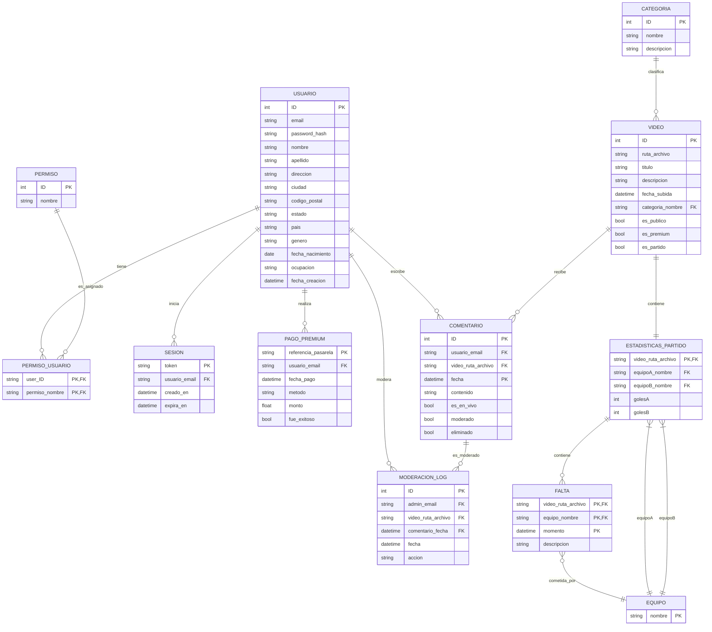

```mermaid
erDiagram

    %% === ENTIDADES PRINCIPALES ===
    USUARIO {
        int ID PK
        string email
        string password_hash
        string nombre
        string apellido
        string direccion
        string ciudad
        string codigo_postal
        string estado
        string pais
        string genero
        date fecha_nacimiento
        string ocupacion
        datetime fecha_creacion
    }

    PERMISO {
        int ID PK
        string nombre
    }

    PERMISO_USUARIO {
        string user_ID PK, FK
        string permiso_nombre PK, FK
    }

    SESION {
        string token PK
        string usuario_email FK
        datetime creado_en
        datetime expira_en
    }

    PAGO_PREMIUM {
        string referencia_pasarela PK
        string usuario_email FK
        datetime fecha_pago
        string metodo
        float monto
        bool fue_exitoso
    }

    CATEGORIA {
        int ID PK
        string nombre
        string descripcion
    }

    VIDEO {
        int ID PK
        string ruta_archivo
        string titulo
        string descripcion
        datetime fecha_subida
        string categoria_nombre FK
        bool es_publico
        bool es_premium
        bool es_partido
    }

    COMENTARIO {
        int ID PK
        string usuario_email FK
        string video_ruta_archivo FK
        datetime fecha PK
        string contenido
        bool es_en_vivo
        bool moderado
        bool eliminado
    }

    MODERACION_LOG {
        int ID PK
        string admin_email FK
        string video_ruta_archivo FK
        datetime comentario_fecha  FK
        datetime fecha
        string accion
    }

    EQUIPO {
        string nombre PK
    }

    ESTADISTICAS_PARTIDO {
        string video_ruta_archivo PK, FK
        string equipoA_nombre FK
        string equipoB_nombre FK
        int golesA
        int golesB
    }

    FALTA {
        string video_ruta_archivo PK, FK
        string equipo_nombre PK, FK
        datetime momento PK
        string descripcion
    }

    %% === RELACIONES ===
    USUARIO ||--o{ SESION : inicia
    USUARIO ||--o{ PAGO_PREMIUM : realiza
    USUARIO ||--o{ COMENTARIO : escribe
    USUARIO ||--o{ PERMISO_USUARIO : tiene
    USUARIO ||--o{ MODERACION_LOG : modera

    PERMISO ||--o{ PERMISO_USUARIO : es_asignado

    VIDEO ||--o{ COMENTARIO : recibe
    VIDEO ||--|| ESTADISTICAS_PARTIDO : contiene

    CATEGORIA ||--o{ VIDEO : clasifica

    COMENTARIO ||--o{ MODERACION_LOG : es_moderado

    ESTADISTICAS_PARTIDO ||--o{ FALTA : contiene
    FALTA }o--|| EQUIPO : cometida_por

    ESTADISTICAS_PARTIDO }|--|| EQUIPO : equipoA
    ESTADISTICAS_PARTIDO }|--|| EQUIPO : equipoB
```
